# Project Overview  


## Background  

Many social animals communicate using vocalizations that can be used to identify their species. The ability to automatically classify audio recordings of animal vocalizations opens up countless opportunities for sound-aware computer applications and could help accelerate studies of these animals. For example, a classifier trained to recognize the call of a specific species of bird could be used to trigger a camera recording, or automatically tag a live audio stream containing avian calls with the species of the bird that made it, producing a time-series record of the presence of this species. 

[Xeno-Canto.org](https://www.xeno-canto.org/)(@xenocanto) is an online community and crowd-sourced Creative Commons database containing audio recordings of avian vocalizations from around the world, indexed by species. It presents a good opportunity for experimentation with machine learning for classification of audio signals. The [Xeno-Canto Avian Vocalizations CA/NV, USA](https://www.kaggle.com/samhiatt/xenocanto-avian-vocalizations-canv-usa)[@xc_ca_nv] dataset was procured for the purpose of jumpstarting exploration into this space. It contains a small subset of the available data, including 30 varying-length audio samples for each of 91 different bird species common in California and Nevada, USA.

Spectrograms (also called sonograms) map audio signals into 2-dimensional frequency-time space and have long been used for studying animal vocalizations. In the book [Bird Song Research: The Past 100 Years](https://courses.washington.edu/ccab/Baker%20-%20100%20yrs%20of%20birdsong%20research%20-%20BB%202001.pdf)(@baker2001bird) Myron Baker describes how a device called the Sona-Graph™, developed by Kay Electric in 1948, began to be used by ornithologists in the early 1950s and accelerated avian bioacoustical research. 

The project [DeepSqueak](https://github.com/DrCoffey/DeepSqueak)(@deepsqueak) at the University of Washington in Seattle uses machine learning to classify spectrograms of ultrasonic vocalizations of mice. Their publication in Nature, [DeepSqueak: a deep learning-based system for detection and analysis of ultrasonic vocalizations](https://www.nature.com/articles/s41386-018-0303-6)(@coffey2019deepsqueak), describes how a convolutional neural network was used to study correlations between types of vocalizations and specific behaviors. DeepSqueak uses a recurrent convolutional neural network (FasterR-CNN) with object region proposals that identify the locations (the time and frequency) of specific vocalizations. 

Inspired by the DeepSqueak's use of spectrograms as inputs to a convolutional neural network, this project takes a similar approach to classify recordings of avian vocalizations. As the XenoCanto.org dataset does not identify the locations of specific vocalizations in the audio samples, it is not viable to use the same Faster R-CNN architecture. A simple CNN is used instead.


## Problem Statement

This project explores the use of 2-dimensional Convolutional Neural Networks for species classification of audio recordings containing avian vocalizations. Using a small subset of the available data from XenoCanto.org, a digital audio classifier is trained and evaluated for its ability to predict the common English name of the most prevalent bird species in a given mp3. 

By taking a neural network-based approach, this classifier is expected to be efficient in terms of its inference execution time as well as its memory and storage footprints. These factors should allow the model to run on a mobile phone, for example, without relying on a connection to the internet.

While many additional samples are available and could be used to improve predictive accuracy for any particular species of interest, or more target species could be added, such refinement is outside the scope of this effort.


## Metrics

Performance is evaluated during model selection and training by calculating the [accuracy score](https://scikit-learn.org/stable/modules/generated/sklearn.metrics.accuracy_score.html) on a 3-fold cross-validation data split of the training data. Originally a 5-fold cross-validation was planned, but after some experimentation it was determined that using 3 folds was sufficient as results were stable between splits.

Evaluation of accuracy is appropriate for a dataset with a balanced number of classes as it gives equal weight to each class, considering all species equally important to identify. Accuracy is defined simply as the portion of samples correctly classified. So, for example, a model that predicts the correct label (1 of 91 classes) half of the time would get a score of `0.50`. 

Final model performance is evaluated by first training the model chosen during the model selection phase against the entire training dataset (without cross-validation splits), and final test accuracy is calculated by predicting labels on the designated test dataset and comparing it to their true values.

# Analysis

## Data Exploration

The included ipython notebook [Data Exploration](../notebooks/Data Exploration.ipynb) demonstrates the use of the `load_data` method to load (and optionally download) the avian vocalizations dataset and includes some exploratory data visualizations. In order to verify that the dataset has a balanced number of samples per class, this distribution is shown in the following graph.

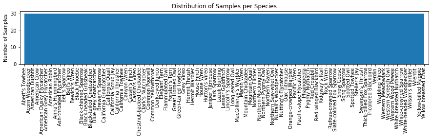{#fig:samples_per_species}

@Fig:samples_per_species shows that the dataset has a balanced distribution in terms of the number of samples per species, with 30 samples for each of 91 species.

The fact that the number of samples per class is balanced is an important consideration as each species should be represented by recordings with a variety of different environmental conditions. If, say, a single sample was chopped up and used to provide multiple samples for training, the model would likely end up overfitting to environmental factors specific to that recording. For example, it could become sensitive to the sound of a waterfall in the background instead of listening to the birds. Having a balanced number of recordings per class should help regularize environmental factors like these. 

Looking at the class distribution in terms of the total duration of audio samples, it is apparent that each species is not equally represented in the dataset. 

{#fig:seconds_per_species}

@Fig:seconds_per_species shows that the total duration of audio samples for each species ranges from 3.1 minutes to 31.3 mins, with an average of 13.5 minutes. This imbalance is due to the process used when originally compiling the dataset. In particular, for each species the 30 _shortest_ samples recorded in California and Nevada were downloaded from xeno-canto.org, with the intention of reducing the load on the servers. This choice resulted in a dataset containing shorter samples for species that are more commonly recorded. This will be an important factor to consider when evaluating model accuracy. 


## Data Visualization

The [librosa](https://librosa.github.io/librosa/index.html) python library for audio analysis is used to load raw mp3 data and generate the features to be fed into the predictive model. Using librosa's [load](https://librosa.github.io/librosa/generated/librosa.core.load.html?highlight=load#librosa.core.load) method with default options automatically resamples the input audio to the default sampling rate of `22,050 samples/s`. This ensures that the temporal resolution of the spectrograms remains consistent across samples. 

Librosa's [melspectrogram](https://librosa.github.io/librosa/generated/librosa.feature.melspectrogram.html) method generates spectrograms on the mel-frequency scale, representing the sound power of each frequency band at each time step in the sample. In @Fig:raw_melsg_XC17804 a mel-frequency power spectrogram generated from the first audio sample in the dataset is shown, along with a histogram showing the distribution of the power spectrogram values.

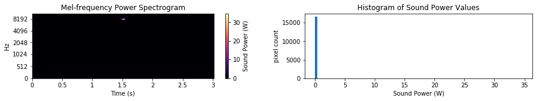{#fig:raw_melsg_XC17804}

It looks like the melspectrogram values have an exponential distribution. Log-scaling the values brings them closer to a normal distribution, as shown in @Fig:log_melsg_XC17804.

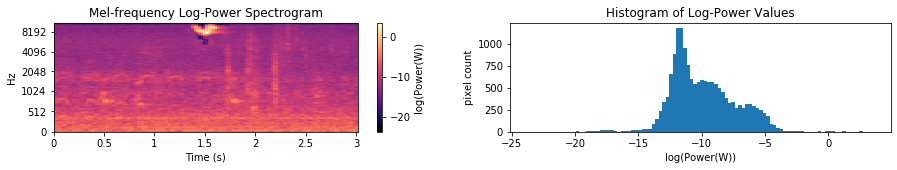{#fig:log_melsg_XC17804}

The librosa library also provides the [mfcc](https://librosa.github.io/librosa/generated/librosa.feature.mfcc.html) method to produce [Mel-Frequency Cepstral Coefficients (MFCCs)](https://en.wikipedia.org/wiki/Mel-frequency_cepstrum), another 2-dimensional representation of audio that is commonly used in voice recognition tasks. MFCCs for the first sample in the dataset are shown in @Fig:mfcc_XC17804.

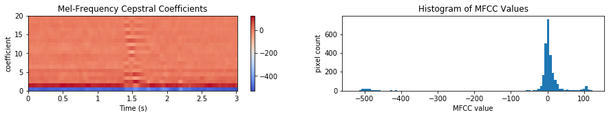{#fig:mfcc_XC17804}

Taking a look at a few more samples, it appears that log-scaling the power spectrogram values does indeed bring them closer to a normal distribution and allows us to visualize the textures of the vocalizations.

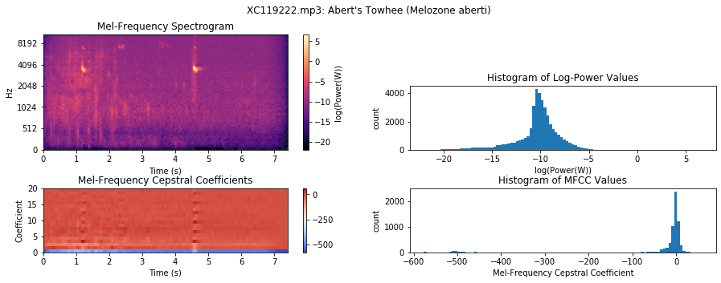{#fig:xc119222}
{#fig:xc79575}
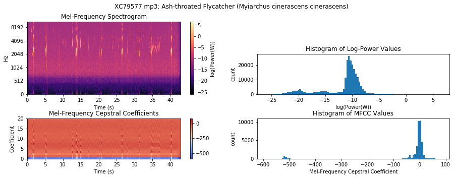{#fig:xc79577}

Most of the MFCC values are normally distributed and fall between -50 and 50, with the exception of the bottom row (the first coefficient) which has values that fall well below the rest, around -500.  

The [Data Exploration](../notebooks/Data Exploration.ipynb) notebook also calculates the aggregate pixel statistics across the entire dataset for both the log-scaled spectrograms as well as the MFCCs. Their values are shown in the table below and are used in the next section for data scaling. 

Feature                    Pixel Count   Mean       Standard Deviation   
-------                  -------------  -----     --------------------   
Log-scaled Spectrograms    412,313,856  -7.40798               3.80885                  
MFCCs                       64,424,040  -19.00330             86.45496                 


## Algorithms and Techniques

Using spectrograms as input data to a neural network essentially turns this into a classic image classification problem. The spectrograms contain distinctive shapes and textures, patterns that a 2-dimensional CNN might learn to identify well. 

Additionally, the MFCC features contain information about the vocal characteristics of the frame. Adding them to the feature space may help improve predictions. Since they are correlated in time with the spectrograms, a convenience technique is applied, concatenating the two input arrays to produce a single 2-dimensional array for input into a CNN. 

### Convolutional Neural Networks
A CNN is composed of two main building-blocks: Convolutional layers and Max Pooling layers. At its base the Convolutional layer "slides" a number of `i X j`-sized "filters" across the input array, calculating the dot product of the filter and the input data at each column and row location and passing the result through an activation function. The Max Pooling layer selects the maximum filter activation at each location in an upsampled grid, and passes this result on to the next layer. By stacking sets of Convolutional and Max Pooling layers, each set of filters can represent increasingly complex patterns, or features, where the filters at the top may be thought of as "feature maps". At the top of this stack, a Global Average Pooling layer computes the average activation of each high-level filter, or feature map, and connects this to the output classes with a fully-connected layer. This output is passed through a softmax activation function, producing a `1 X k` array where the index of the maximum value indicates the predicted class.

### Training with Gradient Descent
The neural network model is trained by minimizing a loss function using a process of Gradient Descent. The loss function is defined as the categorical cross-entropy between the model's predicted labels and the ground truth. The Gradient Descent algorithm repeatedly perturbs the weights of the network (i.e. the values of the filters) in a direction that minimizes the loss function. In particular, the derivative of the loss function with respect to each trainable parameter is calculated, and then each parameter is updated in an amount proportional to its derivative. 

### Regularization
During model training, Dropout layers placed after each Max Pooling layer mask a specific proportion of the input values before passing them onto the next layer. Doing this helps with regularization by essentially forcing the model to develop alternative neural pathways. This, in turn, helps the model generalize better to unseen data. 

### Data Augmentation
To further help the model generalize to unseen data, a data generator is used which crops the input data using a set window length and a random temporal offset. This effectively augments the number of distinct training samples, and also conveniently standardizes the size of the input arrays. 

### Model Selection and Evaluation
Repeated iterations of Gradient Descent using successive batches of training data should gradually increase model accuracy. In order to evaluate performance during training, and in order to compare the performance of experimental models, results are evaluated using a portion of the training data which has been set aside and which the experimental model has never seen. For example, when using a 3-fold cross-validation approach, the training process is repeated 3 different times on 3 different subsets of the training data. After the best model architecture and parameters have been chosen, as determined by comparing validation accuracy, final model performance is evaluated by re-training on the entire training dataset and then evaluating the accuracy on the test dataset. 


## Benchmark

A purely random predictor would be correct 1.1% of the time (1/91 classes). A [Gaussian Naive Bayes classifier](https://scikit-learn.org/stable/modules/generated/sklearn.naive_bayes.GaussianNB.html) applied to the scaled spectrogram pixels should perform better than random guessing and is used as a benchmark predictor. It is expected that this predictor will become sensitive to certain frequency bands that are common in a particular species' vocalizations and that this will give it some predictive power. The naive assumption of feature independence is expected to limit this model's performance, but it should still provide a good baseline. 


# Methodology

## Data Preprocessing

The data preprocessing methodology used to decode audio input files, generate spectral features, calculate statistics, and then scale and normalize data is documented in the Kaggle kernel [Avian Vocalizations: Data Preprocessing](https://www.kaggle.com/samhiatt/avian-vocalizations-data-preprocessing). This follows the same steps taken in the [Data Exploration](../notebooks/Data Exploration.ipynb) notebook, as described in the Exploratory Visualization section above. Mp3s are first decoded and re-sampled to 22,050 Hz, then Mel-frequency spectrograms and MFCCs are computed using librosa. 

The resulting arrays are stored as memory-mapped data files and saved in the Kaggle dataset [Avian Vocalizations: Spectrograms and MFCCs](https://www.kaggle.com/samhiatt/avian-vocalizations-spectrograms-and-mfccs). This dataset is automatically downloaded using the provided [load_data](../avian_vocalizations/data.py) method and is used as input to subsequent processing steps. 

The [AudioFeatureGenerator](../avian_vocalizations/data.py) class provided in this repository is used to read the mem-mapped spectrograms and MFCCs, apply data scaling, and produce batches of equal-length normalized samples with one-hot encoded labels. It is modeled after [Afshine and Shervine Amidi's data generator example](https://stanford.edu/~shervine/blog/keras-how-to-generate-data-on-the-fly)(@amidi). The data generator optionally shuffles the samples, using a seed value to allow reproducibility. By one-hot encoding the labels, categorical classification is possible as this removes the ordinality of the encoded labels. 

The data generator is also responsible for combining the spectrogram and MFCC inputs into a single 2-dimensional array by either concatenating the MFCCs to the top of the spectrograms or by overwriting the lower frequency bands of the spectrograms with the MFCC data. Both of these approaches for combining the arrays were evaluated for performance.

In order to select a random window of a specified length from the input sample, the data generator randomly selects an offset for each sample (again using a seed value for reproducibility). If the input file is shorter than the crop window, then the output array is padded with the dataset mean pixel value, or 0 in the case of a normalized dataset. This choice for padding the samples has implications that are discussed in the results section. 

The dataset was first partitioned with sklearn's [train_test_split](https://scikit-learn.org/stable/modules/generated/sklearn.model_selection.train_test_split.html) method, reserving 1/3 of the dataset for testing, and again supplying a seed value for reproducibility. This data partition is saved in the dataset [Avian Vocalizations: Partitioned Data](https://www.kaggle.com/samhiatt/avian-vocalizations-partitioned-data) and used for training and testing in subsequent steps. It is automatically downloaded with `load_data` as well.

The [Data Generator and Training Example](../notebooks/Data Generator and Training Example.ipynb) notebook includes a few examples of audio samples preprocessed by the AudioFeatureGenerator. Visualizing the generated features demonstrates that the generator is producing equal-length clips of scaled, zero-centered 2-dimensional data. 

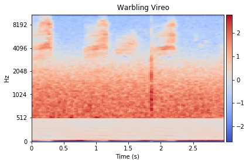

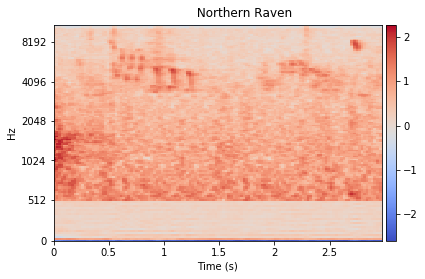

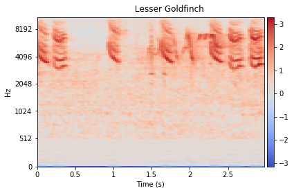

Notice that the MFCC arrays have been combined with the Spectrograms, overwriting the bottom 20 rows of the data. 

## Implementation

A CNN model similar to the one used in the [dog species classifier](https://www.kaggle.com/samhiatt/udacity-dog-project-model-selection-and-tuning) Udacity project is implemented in [model.py](../avian_vocalizations/model.py) and also shown below. This model contains three stacks of 2-dimensional Convolution and Max Pooling layers followed by a Dropout layer. Convolutional layers use a ReLU activation function. The Dropout layer masks 20% of the input neurons from the Max Pooling layers. The output of these stacks is fed into a Global Average Pooling layer, followed by a fully-connected layer with a softmax activation function. The position of the maximum value of this output array corresponds to the predicted label.

```python
    model = Sequential()
    model.add(Conv2D(64, 3, padding='valid', activation="relu",
                     input_shape=(128, 128, 1)))
    model.add(MaxPooling2D(pool_size=3))
    model.add(Dropout(rate=.2))
    model.add(Conv2D(64, 3, padding='valid', activation="relu"))
    model.add(MaxPooling2D(pool_size=3))
    model.add(Dropout(rate=.2))
    model.add(Conv2D(64, 3, padding='valid', activation="relu"))
    model.add(MaxPooling2D(pool_size=3))
    model.add(Dropout(rate=.2))
    model.add(GlobalAveragePooling2D())
    model.add(Dense(n_classes, activation="softmax"))
```

Sklearn's [StratifiedShuffleSplit](https://scikit-learn.org/stable/modules/generated/sklearn.model_selection.StratifiedShuffleSplit.html) function is used to create 3 sets of validation data from the training data, and then each training split is used to train the network using the data generator implemented in [data.py](../avian_vocalizations/data.py). The [keras Sequence.fit_generator](https://keras.io/models/sequential/#fit_generator) method is used to train and evaluate the model after each training epoch using instances of the data generator. Evaluation is performed on a single batch containing all of the validation samples. The validation data generator does not shuffle the data, however, it does still augment the data by producing different cropped windows for each epoch. 

The included notebook [Data Generator and Training Example](../notebooks/Data Generator and Training Example.ipynb) demonstrates the training pipeline with cross-validation. Running it verifies that the model is able to retrieve batches from the training generator and evaluate accuracy against the validation data. This same structure is used to train and evaluate different versions of the model. The results of these experiments are reported in the next section.


## Refinement

Several different model configurations were trained and evaluated as ipython kernels on kaggle.com. It was observed, in general, that increasing the number of neurons per layer improved accuracy, as was expected.

In an attempt to ensure that each clipped sample included identifiable vocalizations, frame filtering was implemented following the methodology presented in Edoardo Ferrante's notebook [Extract features with Librosa, predict with NB](https://www.kaggle.com/fleanend/extract-features-with-librosa-predict-with-nb)(@ferrante). However, after some initial experimentation, it didn't seem to improve results. It was apparent that it resulted in many more short samples requiring padding and also removed information related to tempo, distorting many of the distinguishing characteristics of the vocalizations in the spectrograms. So this approach was abandoned.

Models with different kernel and Max Pooling sizes, including 1-row tall convolutional kernels and MaxPooling layers were tried out. In the notebook [Avian Vocalizations: CNN Classifier, Version 16](https://www.kaggle.com/samhiatt/avian-vocalizations-cnn-classifier/output?scriptVersionId=18872310) the model includes 64 filters for each convolutional layer and uses 1x4 convolutional kernels and Max Pooling sizes of 1x4, 1x3, and 1x2, respectively for each layer. It is evaluated on 3 splits for 100 epochs and achieves a score of: `0.0762`. This is not much of an improvement over the benchmark. 

In [Avian Vocalizations: CNN Classifier, Version 18](https://www.kaggle.com/samhiatt/avian-vocalizations-cnn-classifier/output?scriptVersionId=18878731) a similar model was evaluated, except with 3x3 convolutional kernels and 2x2 max pooling. It was trained on 3 splits to 100 epochs each and achieved a score of: `0.1238`. 

The model in [Avian Vocalizations: CNN Classifier, Version 17](https://www.kaggle.com/samhiatt/avian-vocalizations-cnn-classifier/output?scriptVersionId=18872556) similarly has 60 filters per layer and uses 3x3 convolutions, but 3x3 max pooling. It achieves a score of: `0.18680`.

All of the versions above use a data generator that concatenates the MFCCs to the top of the spectrograms. Another approach was evaluated using an alternative method to combine the input arrays, simply overwriting the lowest 20 frequencies of the spectrograms with the MFCCs. The idea was that the lower frequencies are unimportant for avian vocalization identification, and the results seemed to support this. The model in [Avian Vocalizations: CNN Classifier, Version 20](https://www.kaggle.com/samhiatt/avian-vocalizations-cnn-classifier?scriptVersionId=18897485) has an identical structure to that in version 17, except that it uses this alternative method of combining inputs. 

Shown below are the learning curves from the output of this training session. The minimum loss is achieved after about 80-100 epochs, indicated in the plots with a red vertical line. 

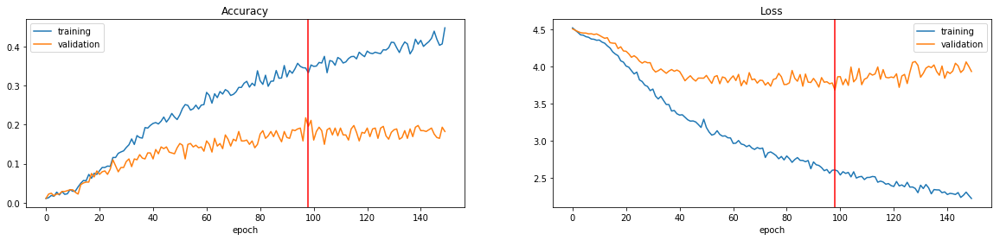

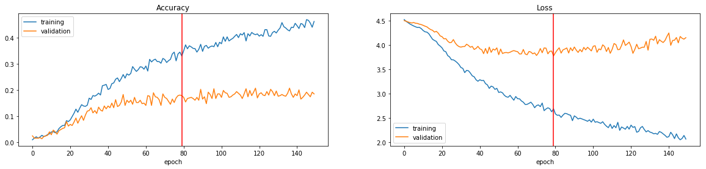

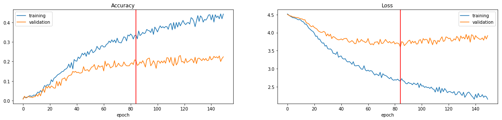

Version 20 achieved the top validation score of `0.1927`. This is the model that was chosen for final evaluation.


# Results

## Model Evaluation and Validation

The model evaluated in the Kaggle kernel [Avian Vocalizations: CNN Classifier, Version 20](https://www.kaggle.com/samhiatt/avian-vocalizations-cnn-classifier?scriptVersionId=18897485) achieved the best score during cross-validation, and it is trained on the entire training dataset (without cross-validation) for 150 epochs in the kernel [Avian Vocalizations: CNN Classifier - Train & Test](https://www.kaggle.com/samhiatt/avian-vocalizations-cnn-classifier-train-test?scriptVersionId=18943170). The resulting weights are saved in the dataset [Avian Vocalizations: CNN Classifier weights](https://www.kaggle.com/samhiatt/avian-vocalizations-cnn-classifier-weights). This trained model is also downloaded automatically with the `load_data` method.

In the notebook [Model Inference and Testing](../notebooks/Model Inference and Testing.ipynb) this model is evaluated against the test dataset and achieves a score of `0.23`. 

The final test accuracy exceeds the accuracy evaluated during training. This was initially somewhat surprising; however, considering that the model was trained on the entire training dataset, as opposed to a subset of the training data used during cross-validation. Having more training samples is apparently improving the model's predictive power.

To evaluate the sensitivity of the model, additional rounds of testing are done while altering the seed value passed to the AudioDataGenerator. Changing the seed value will result in test data cropped with different time offsets. This is done five different times with the following results:

    Epoch 1 test accuracy: 0.24066
    Epoch 2 test accuracy: 0.22418
    Epoch 3 test accuracy: 0.22198
    Epoch 4 test accuracy: 0.22198
    Epoch 5 test accuracy: 0.23077
    Mean test accuracy: 0.22791, Std. deviation: 0.00714

The model appears to be stable, consistently scoring around `0.23 +/- 0.0845`. 

The notebook [Model Inference and Testing](../notebooks/Model Inference and Testing.ipynb) also demonstrates downloading a new mp3 which is not included in the dataset. A sample of an [Elegant Tern](https://www.xeno-canto.org/449570), contributed by [Richard E. Webster](https://www.xeno-canto.org/contributor/KZYUWIRZVH) is downloaded from XenoCanto.org. The Elegant Tern species had the highest accuracy in testing so it should get this one right. Unfortunately, although the model did make a prediction, it incorrectly predicts the sample to be a Phainopepla. There's still room for improvement.


## Justification

The included notebook [Benchmark Model](../notebooks/Benchmark Model.ipynb) trains and tests a Gaussian Naive Bayes classifier using the AudioFeatureGenerator. While the benchmark model achieves a training score of `0.18297`, when evaluated against the test dataset its accuracy only reaches `0.05934`. The mean test accuracy of the CNN-based model was `0.22791`, outperforming the benchmark model by a factor of `3.8 X`. 

To see a breakdown of how the predictor fares for each species, a confusion matrix is plotted in the notebook [Model Inference and Testing](../notebooks/Model Inference and Testing.ipynb) and shown in @Fig:confusion_matrix. 

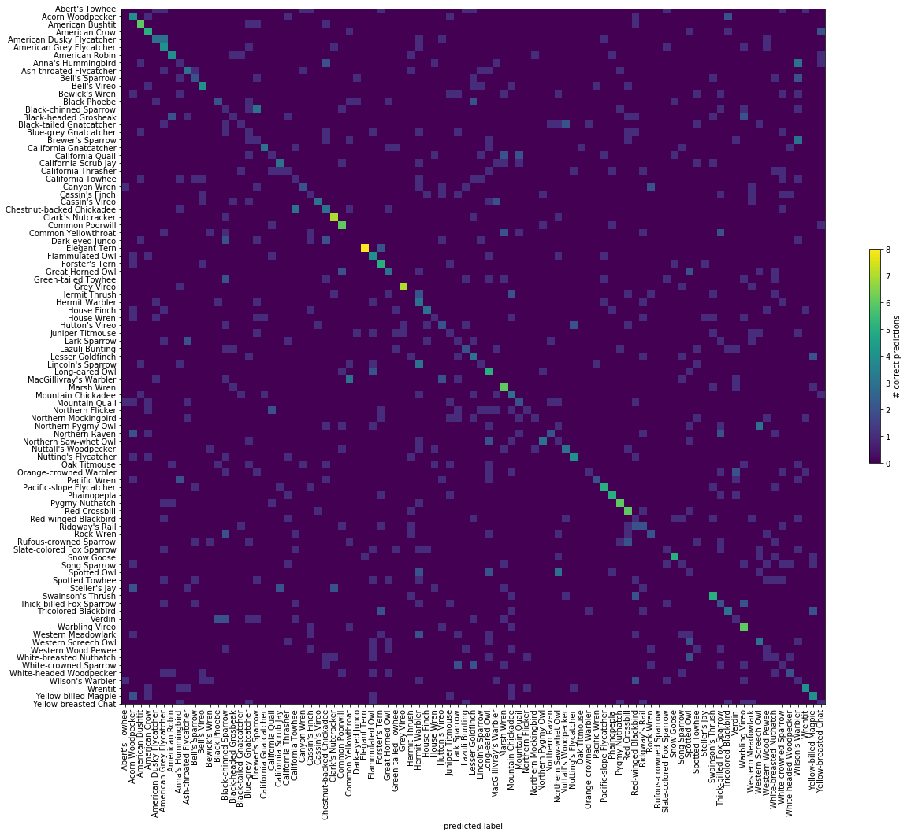{#fig:confusion_matrix}

Visualizing the confusion matrix shows that the accurate predictions along the diagonal are starting to line up. 

Recall that an artifact of the data collection process used to create the original dataset was that species with the most samples available actually end up having shorter samples in the dataset. It is possible that the classifier is somehow picking up on this clue. Knowing that padded clips likely came from one of these classes with shorter samples is a big clue to the classifier, one it won't have when being tested in the wild. This would be a form of data leakage. 

To see if there is a correlation between the total duration of audio per class and class accuracy, a scatter plot is drawn and a linear curve is fitted to the data. 

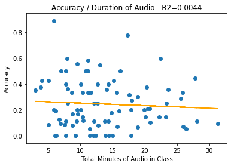{#fig:accuracy_correlation}

@Fig:accuracy_correlation shows a slight negative correlation between the total duration of audio samples and the species class accuracy. The species with shorter samples in the collection end up with greater test accuracy. The `Elegant Tern` species appears to be an outlier. It's scoring 100%. It is also a species that is under-represented in terms of the total duration of audio. This is further evidence of data leakage that should be fixed.


# Conclusion


## Reflection

A convolutional neural network was trained to predict the species of birds contained in audio recordings using labeled audio samples collected from xeno-canto.org. The samples were transformed into spectrograms and MFCCs and fed into a data generator that creates batches of equal length samples clipped from random windows of input data. Several classifiers and network configurations were evaluated using 3-fold cross-validation. The best performing classifier, as measured by calculating overall prediction accuracy, was selected and trained on the entire training dataset. Final classifier performance was evaluated against the test dataset. 

The naive assumption of feature independence inherent in the benchmark Naive Bayes classifier prevents it from learning the distinguishing patterns present in the spectrograms. The translational invariance of the CNN allows it to learn from these patterns even when they appear in different regions of the input data. This is in line with expected results, and in the end a CNN-based classifier was found to achieve a roughly 3X increase in accuracy over the benchmark Naive Bayes model. 

Initial results are encouraging, but they also uncovered some issues with the dataset collection process and the methodology used by the data generator to standardize input sample lengths. 


## Improvement

Several improvements could be made to increase the accuracy of this classifier. The model architecture could be refined, experimenting with different convolution kernel and pooling sizes or by increasing the network depth and increasing memory requirements. Rigorous hyperparameter tuning could further improve accuracy. 

Transfer learning could be also employed. An initial attempt was made in the kernel [Avian Vocalizations: Transfer Learning](https://www.kaggle.com/samhiatt/avian-vocalizations-transfer-learning?scriptVersionId=18845751), but found little success, likely because the spectrograms don't resemble any of the classes in the pre-trained network.

However, It is anticipated that the best gains would result from addressing the data leakage issue presented by zero-padding missing values in short samples, identified in the reflections above. Modifying the generator to simply loop short clips to fill the window would be a simple technique that could address this. Additionally, balancing the training dataset during the data collection process by setting an appropriate lower limit for each audio clip duration would circumvent the need for padding.  

Additionally, improving the data generator methods with appropriate frame filtering to ensure that each cropped sample contains an identifiable vocalization would likely improve predictor performance. Any frame filtering should ensure that any rhythmic features of vocalizations are not distorted, perhaps by setting a buffer around any retained frame. An exploration into more robust audio filtering and window selection methods would likely be rewarded with additional accuracy gains.

The project DeepSqueak addresses this by using a recurrent convolutional neural network (FasterR-CNN) with object region proposals that identify the locations of the vocalizations in the spectrograms. The xeno-canto.org training data does not have object regions labeled and so it can not be readily used in the same way. However, an effort could be made to create such a training dataset with expert input helping to define the regions containing vocalizations. 

More experimentation could be done with the MFCCs. They could be used independently as inputs and analyzed for their predictive power, and they could be combined with the spectrograms in a lower layer of the network. The decision to stack them onto the spectrograms was made out of convenience as it was compatible with the model from the dog breed classifier project.


# References
